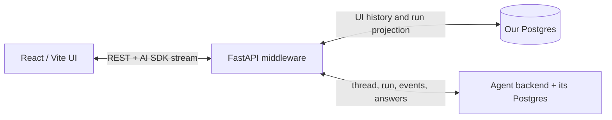
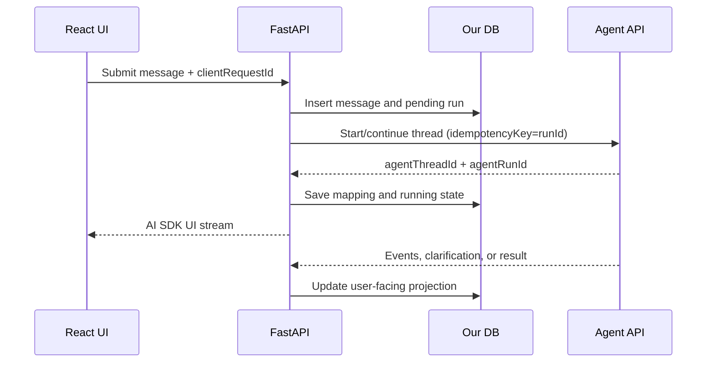

# Durable AI Chat State in React/Vite, FastAPI, and Two Postgres Systems

## Purpose

This guide describes a reusable, production-oriented pattern for an AI chat application with:

- a React/Vite frontend;
- a FastAPI middleware service;
- an application-owned Postgres database ("our DB"); and
- a separate agent backend with its own Postgres database ("the agent DB").

The primary UX requirement is simple:

> A user can submit work in one conversation, switch to another conversation, return later, and see the correct current state: processing, waiting for input, completed, failed, or cancelled.

This is a standard requirement, not an anti-pattern. The important design rule is that a frontend spinner or in-memory registry must not be treated as proof that an agent is still running.

The recommended approach is:

1. **The agent backend owns agent execution and agent context.**
2. **Our FastAPI service and our DB own the user-facing projection of conversations, messages, interactions, and run status.**
3. **TanStack Query caches snapshots obtained from our FastAPI API.**
4. **Vercel AI SDK `Chat`/`useChat` owns the currently streaming UI state.**
5. **An optional, bounded in-memory registry retains `Chat` instances while the user switches between conversations in the same browser tab.**
6. **Every cached or restored non-terminal state is reconciled with the backend.**

The result is fast navigation without making browser memory responsible for correctness.

---

## 1. Terminology

### Caching

Caching means retaining server data in memory so it can be displayed immediately without waiting for another request.

For example:

```text
["conversations", "chat-a"] -> cached ChatSnapshot for chat A
["conversations", "chat-b"] -> cached ChatSnapshot for chat B
```

TanStack Query is appropriate for this server-derived data. It caches separately by query key, returns cached data immediately, and can refetch stale data in the background. Its default inactive-query garbage-collection time is five minutes, so chat applications will commonly increase `gcTime` to retain recently visited conversations for longer. See the official [query-key](https://tanstack.com/query/latest/docs/framework/react/guides/query-keys), [caching](https://tanstack.com/query/latest/docs/framework/react/guides/caching), and [important-defaults](https://tanstack.com/query/latest/docs/framework/react/guides/important-defaults) documentation.

### Cache rehydration

Cache rehydration means restoring a previously serialized cache, usually from `localStorage` or IndexedDB, into TanStack Query after a browser reload.

This is optional. It is not required for switching between routes within a running Vite application because the app-level `QueryClient` already remains in memory. For enterprise or sensitive chat data, avoid browser persistence unless security and retention requirements explicitly permit it.

If persistence is used, use `PersistQueryClientProvider` and configure `gcTime`, `maxAge`, and a build/schema `buster` consistently. TanStack documents the restoration race conditions and provider-based solution in [persistQueryClient](https://tanstack.com/query/latest/docs/framework/react/plugins/persistQueryClient).

### React hydration

React hydration is a different concept: React attaches event handling to HTML that was rendered on a server. A normal client-rendered React/Vite SPA does not use React hydration unless server-side rendering has been added.

In this design, "rehydration" normally means restoring a query cache or reconstructing live chat state—not SSR hydration.

### Run

A **run** is one agent execution initiated by a user request. It has a stable local ID and, after dispatch, a stable agent-side ID.

Do not represent a run only as `isLoading: boolean`. Use a durable state machine.

---

## 2. Architecture and ownership



The frontend must never connect directly to either Postgres database. The FastAPI service is the boundary that performs authorization, translates protocols, maps identifiers, and reconciles the two systems.

### Source-of-truth matrix

| Concern | Authoritative owner | Notes |
| --- | --- | --- |
| User-facing conversation list | Our DB | Titles, ownership, timestamps, deletion/archival state |
| User-facing message rendering | Our DB | Store a UI-oriented message representation such as AI SDK `UIMessage` parts |
| Local request/run status | Our DB | A projection reconciled from agent status/events |
| Agent reasoning context and memory | Agent DB | Referenced through an opaque `agent_thread_id` |
| Actual execution status/result | Agent backend/DB | The ultimate authority when systems disagree |
| Mapping between the two systems | Our DB | `conversation_id -> agent_thread_id`, `run_id -> agent_run_id` |
| Cached conversation snapshot | TanStack Query | Disposable and non-authoritative |
| Live partial message | AI SDK `Chat` | Ephemeral overlay until persisted/reconciled |
| Same-tab live-session registry | Frontend memory | Optional optimization only |

### The most important two-database rule

Do not try to keep two independently editable copies of the same agent history synchronized message by message.

Instead:

- the agent backend owns the thread it uses for future reasoning;
- our DB stores a user-facing projection for rendering, authorization, search, audit, and product-specific metadata;
- our DB records the stable agent identifiers needed to continue the correct agent thread; and
- reconciliation refreshes our projection from the agent API when necessary.

For subsequent turns, FastAPI normally sends the agent:

```json
{
  "agentThreadId": "agent-thread-456",
  "input": {
    "type": "user-message",
    "text": "Continue the analysis"
  },
  "idempotencyKey": "our-run-uuid"
}
```

It should not resend our complete UI transcript as though it were the agent's authoritative memory, unless the agent API explicitly requires a full-history contract. This prevents silent context divergence.

### Never read the agent database directly

Integrate through the agent service API, webhook, or event contract. Direct reads of another service's database couple the middleware to an internal schema, bypass service authorization and invariants, and make migrations unsafe.

### Consequences of keeping a UI projection and an agent history

The simplest reliable product behavior is append-only conversation history. Operations that appear to rewrite history need an explicit cross-system policy:

| User action | Correct handling |
| --- | --- |
| Append a new message | Persist locally, then continue the mapped agent thread |
| Regenerate an answer | Create a new local run linked to the message being regenerated; invoke the agent's supported regenerate/branch operation |
| Edit an earlier user message | Create a branch/new agent thread, or call an agent API that explicitly rewinds the thread |
| Hide/delete a local message | Do not claim it was removed from agent context unless the agent confirms the corresponding operation |
| Delete a conversation | Apply local product/retention policy and separately request agent-thread deletion when the contract and policy support it |

Updating or deleting only our `messages` row changes the user-facing projection but does not change what the agent will remember from its DB. The middleware must either propagate the semantic command or make the product behavior clear.

For a minimal first version, support append, answer clarification, cancel, and whole-conversation deletion. Defer arbitrary historical editing/branching until the agent backend exposes a clear contract. If branching is later introduced, replace the single `agent_thread_id` column with a mapping table containing branch/version identifiers rather than overwriting the old mapping.

---

## 3. Recommended responsibility split in the frontend

The frontend has two different categories of state. Keep them separate.

### TanStack Query: server snapshots

Use TanStack Query for:

- conversation lists;
- persisted messages;
- active and recent run records;
- persisted clarification requests;
- generated artifacts and citations; and
- refetching/reconciliation.

### Vercel AI SDK: live chat transport and rendering state

Use AI SDK `Chat`/`useChat` for:

- immediate optimistic display of the submitted user message;
- consuming the AI SDK UI Message Stream protocol;
- assembling text deltas into message parts;
- rendering typed tool/data parts; and
- the transport state of the current HTTP exchange: `submitted`, `streaming`, `ready`, or `error`.

AI SDK documents `UIMessage` as the UI-oriented representation containing message IDs, metadata, typed data, and tool parts. This is distinct from a model's prompt/context representation. See [`UIMessage`](https://ai-sdk.dev/docs/reference/ai-sdk-core/ui-message) and [message persistence](https://ai-sdk.dev/docs/ai-sdk-ui/chatbot-message-persistence).

### Do not confuse transport status with durable run status

These are different:

```ts
// Short-lived state of the browser's current stream request.
type TransportStatus = "submitted" | "streaming" | "ready" | "error";

// Durable business state of the agent execution.
type RunStatus =
  | "pending_dispatch"
  | "queued"
  | "running"
  | "awaiting_input"
  | "completed"
  | "failed"
  | "cancelled"
  | "expired"
  | "unknown";
```

An HTTP stream can be `ready` because it closed after emitting a clarification question while the durable run is still `awaiting_input`. Conversely, a stream can disconnect with `error` while the agent continues running successfully.

The UI should derive the persistent indicator from `RunStatus`, not solely from `useChat().status`.

---

## 4. Minimal database model in our Postgres

The following is intentionally small. It stores current state rather than implementing full event sourcing.

```sql
create table conversations (
    id uuid primary key,
    user_id uuid not null,
    title text,
    agent_thread_id text,
    snapshot_version bigint not null default 0,
    created_at timestamptz not null default now(),
    updated_at timestamptz not null default now()
);

create table messages (
    id uuid primary key,
    conversation_id uuid not null references conversations(id),
    sequence_no bigint not null,
    role text not null check (role in ('system', 'user', 'assistant')),
    parts jsonb not null default '[]'::jsonb,
    metadata jsonb not null default '{}'::jsonb,
    client_message_id text,
    agent_message_id text,
    created_at timestamptz not null default now(),
    updated_at timestamptz not null default now(),
    unique (conversation_id, sequence_no),
    unique (conversation_id, client_message_id)
);

create table runs (
    id uuid primary key,
    conversation_id uuid not null references conversations(id),
    user_message_id uuid not null references messages(id),
    assistant_message_id uuid references messages(id),
    client_request_id text not null,
    agent_run_id text,
    status text not null check (status in (
        'pending_dispatch', 'queued', 'running', 'awaiting_input',
        'completed', 'failed', 'cancelled', 'expired', 'unknown'
    )),
    last_agent_event_seq bigint,
    error jsonb,
    heartbeat_at timestamptz,
    created_at timestamptz not null default now(),
    updated_at timestamptz not null default now(),
    finished_at timestamptz,
    unique (conversation_id, client_request_id),
    unique (agent_run_id)
);

create table interactions (
    id uuid primary key,
    run_id uuid not null references runs(id),
    agent_interaction_id text not null,
    kind text not null,
    status text not null check (status in (
        'pending', 'answer_pending', 'answered', 'expired', 'failed'
    )),
    request_payload jsonb not null,
    response_payload jsonb,
    created_at timestamptz not null default now(),
    answered_at timestamptz,
    unique (run_id, agent_interaction_id)
);

create table run_steps (
    id uuid primary key,
    run_id uuid not null references runs(id),
    source_system text not null,
    source_step_id text not null,
    local_sequence_no bigint not null,
    label text not null,
    status text not null check (status in (
        'queued', 'running', 'completed', 'failed', 'skipped'
    )),
    display_payload jsonb not null default '{}'::jsonb,
    source_event_seq bigint,
    started_at timestamptz,
    completed_at timestamptz,
    updated_at timestamptz not null default now(),
    unique (run_id, source_system, source_step_id),
    unique (run_id, local_sequence_no)
);

create unique index one_active_run_per_conversation
on runs (conversation_id)
where status in ('pending_dispatch', 'queued', 'running', 'awaiting_input');
```

The partial unique index is a useful simplification if the product allows only one active run per conversation. Remove it only if parallel runs inside the same conversation are a deliberate feature.

### Why store message parts as JSONB?

AI messages can contain text, sources, structured widgets, files, tool interactions, charts, and clarification controls. A JSONB `parts` field preserves this extensible UI shape without creating a new relational table for every part type.

Keep the stable, frequently queried fields—conversation ID, role, ordering, run status, ownership, timestamps, and cross-system IDs—as normal columns.

`run_steps` stores only display-safe, structured progress such as "Querying data", "Generating document", and "Saving result". It must not become a store for private chain-of-thought or unrestricted backend logs. If exact integration-event replay is required, add a narrowly scoped, access-controlled event table containing normalized event envelopes; do not persist raw model reasoning by default.

---

## 5. API contract

A minimal API surface is:

```text
GET  /api/conversations
GET  /api/conversations/{conversationId}
POST /api/chat
GET  /api/conversations/{conversationId}/stream
GET  /api/runs/{runId}
POST /api/runs/{runId}/cancel
POST /api/runs/{runId}/interactions/{interactionId}/answer
```

`POST /api/chat` is the AI SDK-compatible streaming submission endpoint. Its body carries `conversationId`; a project may instead use a nested conversation URL and adapt the transport accordingly.

`GET /api/conversations/{conversationId}` should return one coherent snapshot:

```ts
type ChatSnapshot = {
  conversationId: string;
  version: number;
  messages: AppUIMessage[];
  activeRun: null | {
    id: string;
    agentRunId: string | null;
    status: RunStatus;
    lastEventSequence?: number;
    updatedAt: string;
  };
  actionRequired: null | {
    type: "clarification";
    interactionId: string;
  };
};
```

Returning messages, the active run, and the current action requirement together prevents a frontend race in which it renders a completed transcript with a stale `running` flag or fails to expose a pending clarification. Persisted clarification and step records should be projected into stable typed parts inside `messages`; the top-level `actionRequired` field exists for control logic and sidebar badges, not as a second copy of the question.

Every endpoint must authorize the current user against the local conversation before using an agent thread/run ID.

---

## 6. Submission lifecycle



### Step-by-step rules

1. The frontend generates a stable `clientRequestId` before submission.
2. FastAPI checks authorization and starts a local database transaction.
3. It inserts the user message and a `pending_dispatch` run, or returns the existing run for the same idempotency key.
4. It commits before calling the remote agent.
5. It calls the agent with the local `run.id` as the agent idempotency key.
6. It stores the returned `agent_thread_id` and `agent_run_id`.
7. It adapts agent events to the AI SDK UI Message Stream protocol for the browser.
8. Agent completion, failure, cancellation, and clarification are persisted in our DB independently of whether the browser remains connected.

### Why commit locally before the remote call?

Our Postgres and the agent Postgres cannot participate in one ordinary local transaction. A crash can occur between the two writes. The standard answer is idempotency plus reconciliation, not pretending the dual write is atomic.

For a minimal implementation:

- create the local run first;
- use its ID as the agent idempotency key;
- retry ambiguous dispatches safely; and
- reconcile stale non-terminal local runs against the agent status API.

If losing a submission during a prolonged dependency outage is unacceptable, add a transactional outbox row in the same local transaction and dispatch it with a worker. This is a well-established reliability pattern; see Microsoft's [transactional outbox guidance](https://learn.microsoft.com/en-us/azure/architecture/databases/guide/transactional-out-box-cosmos). Do not introduce a full Saga or event-sourced architecture merely to solve this one workflow unless broader requirements justify the added complexity.

### FastAPI service sketch

This is structural pseudocode; database and agent-client details are intentionally replaceable.

```py
from uuid import UUID

from fastapi import APIRouter, Depends
from pydantic import BaseModel, ConfigDict, Field

router = APIRouter()


class SubmitMessage(BaseModel):
    model_config = ConfigDict(populate_by_name=True)

    conversation_id: UUID = Field(alias="conversationId")
    client_request_id: str = Field(alias="clientRequestId")
    message: dict
    trigger: str = "submit-message"


@router.post("/api/chat")
async def submit_message(
    body: SubmitMessage,
    user=Depends(current_user),
):
    # 1. Authorize and create-or-get is atomic in our Postgres.
    run = await run_service.create_or_get(
        user_id=user.id,
        conversation_id=body.conversation_id,
        client_request_id=body.client_request_id,
        ui_message=body.message,
    )

    # 2. Dispatch is safe to retry because run.id is the idempotency key.
    run = await run_service.ensure_dispatched(run)

    # 3. This subscribes for delivery; it must not be the only mechanism that
    #    records completion. A callback/reconciler updates our DB separately.
    return ai_sdk_stream_response(run)
```

### Critical backend requirement

The agent run must not depend on the browser keeping one HTTP request open.

Preferred choices, in order:

1. The agent backend runs durably and sends a signed webhook/callback on state changes.
2. The agent backend runs durably and our worker polls/reconciles its status/result.
3. A middleware worker owns the long-running agent connection independently of the browser.

If the only agent API is a request-bound stream that cancels the computation when its consumer disconnects, same-tab frontend caching cannot provide reload resilience. The backend contract must be improved, or the middleware must own a durable worker/stream.

FastAPI `BackgroundTasks` is suitable for small same-process work, but its own documentation recommends a proper multi-process job system for heavier work. See [FastAPI background-task caveats](https://fastapi.tiangolo.com/tutorial/background-tasks/). Prefer an existing worker/scheduler, agent callback, or reconciliation job for durable run supervision.

---

## 7. Streaming through FastAPI with AI SDK 6

AI SDK `useChat` is not restricted to a TypeScript backend. A custom FastAPI backend can emit the [UI Message Stream protocol](https://ai-sdk.dev/docs/ai-sdk-ui/stream-protocol).

The response must be SSE and include:

```http
Content-Type: text/event-stream
x-vercel-ai-ui-message-stream: v1
Cache-Control: no-cache
```

An adapter can translate agent events as follows:

```py
import json
from collections.abc import AsyncIterator

from fastapi.responses import StreamingResponse


def sse(part: dict) -> bytes:
    return f"data: {json.dumps(part, separators=(',', ':'))}\n\n".encode()


async def to_ai_sdk_stream(run) -> AsyncIterator[bytes]:
    message_id = str(run.assistant_message_id)
    text_part_id = f"text-{message_id}"

    yield sse({"type": "start", "messageId": message_id})
    yield sse({"type": "text-start", "id": text_part_id})

    async for event in agent_client.subscribe(run.agent_run_id):
        if event.type == "text.delta":
            yield sse({
                "type": "text-delta",
                "id": text_part_id,
                "delta": event.delta,
            })

        elif event.type == "clarification.requested":
            # Persistent data part: it will be present after reload.
            yield sse({
                "type": "data-clarification",
                "id": str(event.interaction_id),
                "data": {
                    "runId": str(run.id),
                    "interactionId": str(event.interaction_id),
                    "question": event.question,
                    "options": event.options,
                    "status": "pending",
                },
            })

        elif event.type == "step.updated":
            # Reusing the same part ID updates the existing UI block.
            yield sse({
                "type": "data-run-step",
                "id": f"step:{run.id}:{event.source}:{event.step_id}",
                "data": {
                    "runId": str(run.id),
                    "sequence": event.local_sequence_no,
                    "source": event.source,
                    "label": event.label,
                    "status": event.status,
                    "detail": event.display_detail,
                },
            })

        elif event.type == "run.failed":
            yield sse({"type": "error", "errorText": "The run failed."})
            break

    yield sse({"type": "text-end", "id": text_part_id})
    yield sse({"type": "finish", "finishReason": "stop"})
    yield b"data: [DONE]\n\n"


def ai_sdk_stream_response(run) -> StreamingResponse:
    return StreamingResponse(
        to_ai_sdk_stream(run),
        media_type="text/event-stream",
        headers={
            "x-vercel-ai-ui-message-stream": "v1",
            "Cache-Control": "no-cache, no-transform",
            # Helpful when using Nginx; harmless elsewhere.
            "X-Accel-Buffering": "no",
        },
    )
```

FastAPI also has first-class SSE support, but `StreamingResponse` is sufficient when the adapter already formats the AI SDK SSE frames. See the official [FastAPI streaming](https://fastapi.tiangolo.com/advanced/custom-response/) and [SSE](https://fastapi.tiangolo.com/tutorial/server-sent-events/) documentation.

### Do not persist every token by default

Persist:

- the user message immediately;
- the run and status transitions immediately;
- clarification requests immediately;
- the final assistant message when complete; and
- optionally a throttled partial-message checkpoint if recovering partial text is a product requirement.

Writing to Postgres for every token creates unnecessary write amplification. A practical checkpoint is every 0.5–2 seconds or every few kilobytes, but omit it entirely if the agent backend can return the current/final output during reconciliation.

---

## 8. TanStack Query setup

### Stable query keys

```ts
export const chatKeys = {
  all: ["conversations"] as const,
  lists: () => [...chatKeys.all, "list"] as const,
  list: (filters: Record<string, unknown>) =>
    [...chatKeys.lists(), filters] as const,
  details: () => [...chatKeys.all, "detail"] as const,
  detail: (conversationId: string) =>
    [...chatKeys.details(), conversationId] as const,
};
```

Any variable used by a query function must be included in its query key. This allows chat A and chat B to have independent cache entries.

### Query client defaults

```ts
import { QueryClient } from "@tanstack/react-query";

export const queryClient = new QueryClient({
  defaultOptions: {
    queries: {
      staleTime: 10_000,
      gcTime: 30 * 60_000,
      retry: 2,
      refetchOnReconnect: true,
      refetchOnWindowFocus: true,
    },
    mutations: {
      retry: 0,
    },
  },
});
```

These are starting values, not universal constants:

- `staleTime: 10s` avoids immediate repetitive reads while allowing prompt reconciliation.
- `gcTime: 30m` makes switching among recent chats instant.
- mutation retries are disabled at the generic client layer because writes require deliberate idempotency semantics.

### Conversation snapshot query

```ts
import { useQuery } from "@tanstack/react-query";

async function getConversation(id: string): Promise<ChatSnapshot> {
  const response = await fetch(`/api/conversations/${id}`, {
    credentials: "include",
  });

  if (!response.ok) throw new Error("Could not load conversation");
  return response.json();
}

export function useConversation(conversationId: string) {
  return useQuery({
    queryKey: chatKeys.detail(conversationId),
    queryFn: () => getConversation(conversationId),
    // Poll only as a fallback when an active run is not covered by a live
    // resumable stream or app-level event connection.
    refetchInterval: query => {
      const run = query.state.data?.activeRun;
      return run && !isTerminal(run.status) ? 3_000 : false;
    },
  });
}
```

If a live stream or global event channel is reliably updating the query cache, disable the polling interval. Polling and streaming the same status continuously is wasteful.

### Updating cache from known results

Use immutable `setQueryData` updates for discrete status events, or invalidate and refetch when the complete server snapshot is safer:

```ts
queryClient.setQueryData<ChatSnapshot>(
  chatKeys.detail(conversationId),
  old =>
    old
      ? {
          ...old,
          activeRun: old.activeRun
            ? { ...old.activeRun, status: "awaiting_input" }
            : null,
        }
      : old,
);

await queryClient.invalidateQueries({
  queryKey: chatKeys.detail(conversationId),
});
```

TanStack explicitly requires immutable cache updates; see [updates from mutation responses](https://tanstack.com/query/latest/docs/framework/react/guides/updates-from-mutation-responses).

Do not update the TanStack cache for every text token if `Chat` already owns the live message. Synchronize on meaningful domain events and refetch on finish.

### Off-screen domain events

The per-conversation AI SDK stream carries rich message content for that conversation. It does not, by itself, give the rest of the application a reliable way to know that an off-screen conversation now needs attention.

Use one lightweight, app-level event channel from FastAPI for cross-conversation signals, or poll the conversation list if near-real-time badges are unnecessary. The channel should carry small durable hints—not token deltas:

```ts
type AppEvent = {
  eventId: string;
  conversationId: string;
  runId: string;
  sequence: number;
  type:
    | "run.status-changed"
    | "interaction.requested"
    | "interaction.answered"
    | "message.committed";
  snapshotVersion: number;
  occurredAt: string;
};
```

FastAPI can expose this as a user-scoped SSE endpoint:

```text
GET /api/events
```

The React application opens it once above the router. A clarification event updates the sidebar/action-required state and invalidates the relevant snapshot:

```tsx
import { useEffect } from "react";

export function useAppEvents() {
  useEffect(() => {
    const events = new EventSource("/api/events", { withCredentials: true });

    events.onmessage = message => {
      const event = JSON.parse(message.data) as AppEvent;

      if (
        event.type === "interaction.requested" ||
        event.type === "interaction.answered" ||
        event.type === "message.committed" ||
        event.type === "run.status-changed"
      ) {
        void queryClient.invalidateQueries({
          queryKey: chatKeys.detail(event.conversationId),
        });
        void queryClient.invalidateQueries({ queryKey: chatKeys.lists() });
      }
    };

    // The stream is a notification mechanism, not the source of truth. On
    // reconnect, normal TanStack refetch-on-reconnect reconciles missed events.
    return () => events.close();
  }, []);
}
```

If authentication requires bearer headers rather than same-site cookies, use a fetch-based SSE client because the browser `EventSource` API cannot attach arbitrary headers.

Do not broadcast text deltas or every step update through this global channel. The hidden conversation's AI SDK `Chat` instance can continue its existing stream when retained; otherwise FastAPI persists the steps and the conversation snapshot supplies them when the user returns. This avoids one global stream becoming a second chat protocol.

---

## 9. AI SDK transport

AI SDK 6 uses a transport abstraction. `DefaultChatTransport` can target the FastAPI endpoint and customize both submission and reconnection. See the official [`useChat`](https://ai-sdk.dev/docs/reference/ai-sdk-ui/use-chat) and [transport](https://ai-sdk.dev/docs/ai-sdk-ui/transport) documentation.

```ts
import { DefaultChatTransport, type UIMessage } from "ai";

export type AppUIMessage = UIMessage<
  {
    createdAt?: string;
    runId?: string;
    clientRequestId?: string;
  },
  {
    clarification: {
      runId: string;
      interactionId: string;
      question: string;
      options?: Array<{ value: string; label: string }>;
      status:
        | "pending"
        | "answer-pending"
        | "answered"
        | "expired"
        | "failed";
    };
    "run-step": {
      runId: string;
      sequence: number;
      source: string;
      label: string;
      status: "queued" | "running" | "completed" | "failed" | "skipped";
      detail?: string;
    };
  }
>;

export function createChatTransport() {
  return new DefaultChatTransport({
    api: "/api/chat",
    credentials: "include",

    prepareSendMessagesRequest: ({ id, messages, trigger, messageId }) => {
      const newestMessage = messages.at(-1);

      return {
        body: {
          conversationId: id,
          trigger,
          // The agent owns its context. Send the new input, not an assumed
          // authoritative copy of the full UI history.
          message: trigger === "submit-message" ? newestMessage : undefined,
          messageId,
          clientRequestId:
            newestMessage?.metadata?.clientRequestId ??
            messageId ??
            newestMessage?.id,
        },
      };
    },

    prepareReconnectToStreamRequest: ({ id }) => ({
      api: `/api/conversations/${id}/stream`,
      credentials: "include",
    }),
  });
}
```

Generate the idempotency key once, before calling `sendMessage`, and attach it as message metadata:

```ts
const clientRequestId = crypto.randomUUID();

await sendMessage({
  text,
  metadata: { clientRequestId },
});
```

The FastAPI route can be `/api/chat` or `/api/conversations/{id}/messages`; choose one convention and adapt it in the transport. The important properties are a stable contract and reuse of the same `clientRequestId` when an ambiguous submission is retried.

### Validate at the server boundary

The browser is untrusted. FastAPI should validate:

- conversation ownership;
- permitted message roles and part types;
- maximum sizes;
- attachment references;
- `clientRequestId` format and uniqueness scope; and
- clarification answers against the stored pending interaction.

AI SDK's TypeScript persistence guide recommends validating stored `UIMessage` values when they contain tools, metadata, or custom data parts. In a Python backend, implement the equivalent schemas with Pydantic and version persisted message formats.

---

## 10. Should the frontend use a chat registry?

### Short answer

Yes, a bounded in-memory registry of AI SDK `Chat` instances is a reasonable optimization for same-tab switching. It is not the durability mechanism.

AI SDK supports passing an existing `Chat` instance to `useChat`, and its official cookbook demonstrates sharing one instance across components. See [Share `useChat` State Across Components](https://ai-sdk.dev/cookbook/next/use-shared-chat-context).

For several conversations, extend that pattern to a map keyed by `conversationId`.

### Registry responsibilities

The registry may:

- retain a live `Chat` while its screen component is unmounted;
- preserve partial text when switching chats within the same tab;
- prevent duplicate stream connections to the same run; and
- expose the same `Chat` instance to the transcript and composer.

The registry must not:

- decide that a backend run is still alive;
- replace TanStack Query as the snapshot cache;
- be serialized to local storage;
- grow without a TTL or size limit; or
- recreate a request merely because a screen remounted.

### Bounded registry example

```ts
import { Chat } from "@ai-sdk/react";

type RegistryEntry = {
  chat: Chat<AppUIMessage>;
  // Track partial projection merges separately from full replacements.
  projectionSnapshotVersion: number;
  fullSnapshotVersion: number;
  lastUsedAt: number;
};

class ChatRegistry {
  private entries = new Map<string, RegistryEntry>();

  constructor(
    private readonly maxEntries = 12,
    private readonly ttlMs = 30 * 60_000,
  ) {}

  getOrCreate(snapshot: ChatSnapshot): RegistryEntry {
    const current = this.entries.get(snapshot.conversationId);

    // Keep the same Chat object so an in-flight transport is not torn down.
    // A mounted useChat reconciles any newer durable snapshot below.
    if (current) {
      current.lastUsedAt = Date.now();
      return current;
    }

    const chat = new Chat<AppUIMessage>({
      id: snapshot.conversationId,
      messages: snapshot.messages,
      transport: createChatTransport(),
      onFinish: () => {
        void queryClient.invalidateQueries({
          queryKey: chatKeys.detail(snapshot.conversationId),
        });
      },
    });

    const entry: RegistryEntry = {
      chat,
      projectionSnapshotVersion: snapshot.version,
      fullSnapshotVersion: snapshot.version,
      lastUsedAt: Date.now(),
    };
    this.entries.set(snapshot.conversationId, entry);

    this.evictIdleEntries();
    return entry;
  }

  markProjectionHydrated(conversationId: string, version: number) {
    const entry = this.entries.get(conversationId);
    if (entry) {
      entry.projectionSnapshotVersion = Math.max(
        entry.projectionSnapshotVersion,
        version,
      );
    }
  }

  markFullyHydrated(conversationId: string, version: number) {
    const entry = this.entries.get(conversationId);
    if (entry) {
      entry.fullSnapshotVersion = Math.max(entry.fullSnapshotVersion, version);
      entry.projectionSnapshotVersion = Math.max(
        entry.projectionSnapshotVersion,
        version,
      );
    }
  }

  delete(conversationId: string) {
    this.entries.delete(conversationId);
  }

  clear() {
    this.entries.clear();
  }

  private evictIdleEntries() {
    const now = Date.now();
    const candidates = [...this.entries.entries()]
      .filter(([, entry]) =>
        entry.chat.status !== "submitted" &&
        entry.chat.status !== "streaming" &&
        now - entry.lastUsedAt > this.ttlMs,
      )
      .sort((a, b) => a[1].lastUsedAt - b[1].lastUsedAt);

    for (const [id] of candidates) this.entries.delete(id);

    const remainingIdle = [...this.entries.entries()]
      .filter(([, entry]) =>
        entry.chat.status !== "submitted" &&
        entry.chat.status !== "streaming",
      )
      .sort((a, b) => a[1].lastUsedAt - b[1].lastUsedAt);

    while (this.entries.size > this.maxEntries && remainingIdle.length) {
      const [id] = remainingIdle.shift()!;
      this.entries.delete(id);
    }
  }
}

export const chatRegistry = new ChatRegistry();
```

The registry should be created once at the application layer, not inside the routed chat component. Clear it on logout or user/tenant change.

Do not reject a newer server snapshot merely because the local `Chat` still says `streaming`. The stream may have broken while the route was hidden, and the newer snapshot may contain a clarification or completed step that the browser missed. Keep the `Chat` instance, then merge the newer durable projection into it.

The following helper replaces or appends only the persistent interactive and step parts while a local stream is active. It deliberately preserves local text deltas that may be newer than the last database flush. Stable message IDs and stable data-part IDs are required.

```ts
type AppPart = AppUIMessage["parts"][number];

function durablePartKey(part: AppPart): string | null {
  if (
    part.type !== "data-clarification" &&
    part.type !== "data-run-step"
  ) {
    return null;
  }

  return typeof part.id === "string" ? `${part.type}:${part.id}` : null;
}

function mergeDurableProjection(
  current: AppUIMessage[],
  persisted: AppUIMessage[],
): AppUIMessage[] {
  const persistedByMessage = new Map(
    persisted.map(message => [message.id, message]),
  );

  const merged = current.map(message => {
    const fromDb = persistedByMessage.get(message.id);
    if (!fromDb) return message;

    const durableFromDb = new Map(
      fromDb.parts.flatMap(part => {
        const key = durablePartKey(part);
        return key ? [[key, part] as const] : [];
      }),
    );
    const consumed = new Set<string>();

    const parts = message.parts.map(part => {
      const key = durablePartKey(part);
      const replacement = key ? durableFromDb.get(key) : undefined;
      if (!key || !replacement) return part;
      consumed.add(key);
      return replacement;
    });

    for (const [key, part] of durableFromDb) {
      if (!consumed.has(key)) parts.push(part);
    }

    return { ...message, parts };
  });

  // A completely missed persisted message is safe to append in full. Existing
  // messages keep their live text and receive only durable part updates above.
  const currentIds = new Set(current.map(message => message.id));
  for (const message of persisted) {
    if (!currentIds.has(message.id)) merged.push(message);
  }

  return merged;
}
```

### Routed chat component

```tsx
import { useChat } from "@ai-sdk/react";
import { useEffect, useRef } from "react";

export function ChatRoute({ conversationId }: { conversationId: string }) {
  const query = useConversation(conversationId);

  if (query.isPending) return <ChatSkeleton />;
  if (query.isError) return <ChatLoadError />;

  return <LoadedChat snapshot={query.data} />;
}

function LoadedChat({ snapshot }: { snapshot: ChatSnapshot }) {
  const entry = chatRegistry.getOrCreate(snapshot);
  const resumeAttemptedForRun = useRef<string | null>(null);
  const {
    messages,
    status: transportStatus,
    sendMessage,
    resumeStream,
    setMessages,
  } = useChat({ chat: entry.chat });

  useEffect(() => {
    const hasLiveLocalDeltas =
      transportStatus === "submitted" || transportStatus === "streaming";
    const snapshotIsTerminal =
      !snapshot.activeRun || isTerminal(snapshot.activeRun.status);

    // A terminal server snapshot is authoritative once local streaming has
    // stopped. Until then, preserve possible newer text deltas and merge only
    // the durable interaction/step projection.
    if (!hasLiveLocalDeltas && snapshotIsTerminal) {
      if (snapshot.version <= entry.fullSnapshotVersion) return;

      setMessages(snapshot.messages);
      chatRegistry.markFullyHydrated(
        snapshot.conversationId,
        snapshot.version,
      );
      return;
    }

    if (snapshot.version <= entry.projectionSnapshotVersion) return;

    setMessages(current =>
      mergeDurableProjection(current, snapshot.messages),
    );
    chatRegistry.markProjectionHydrated(
      snapshot.conversationId,
      snapshot.version,
    );
  }, [
    entry,
    setMessages,
    snapshot.conversationId,
    snapshot.messages,
    snapshot.version,
    transportStatus,
  ]);

  useEffect(() => {
    const run = snapshot.activeRun;
    if (
      run &&
      !isTerminal(run.status) &&
      transportStatus === "ready" &&
      resumeAttemptedForRun.current !== run.id
    ) {
      // The resume endpoint should return 204 if no stream is available.
      // Polling/reconciliation remains the fallback for durable correctness.
      resumeAttemptedForRun.current = run.id;
      resumeStream();
    }
  }, [snapshot.activeRun, transportStatus, resumeStream]);

  return (
    <ChatView
      messages={messages}
      runStatus={snapshot.activeRun?.status ?? null}
      transportStatus={transportStatus}
      onSend={text =>
        sendMessage({
          text,
          metadata: { clientRequestId: crypto.randomUUID() },
        })
      }
    />
  );
}
```

AI SDK's [`useChat`](https://ai-sdk.dev/docs/reference/ai-sdk-ui/use-chat) exposes `setMessages` specifically for local message-state updates without an API request. Here it is a reconciliation mechanism, not a second source of truth.

In Strict Mode, effects can run more than once during development. The reconnect endpoint, merge, and registry must therefore be idempotent and prevent duplicate subscriptions or blocks.

---

## 11. Switching chats and returning

The expected flow is:

1. Chat A submits a request.
2. The local run is persisted and the agent run starts.
3. The user navigates to Chat B.
4. Chat A's screen unmounts, but the agent run does not depend on that component.
5. If a registry entry remains, its `Chat` instance can continue receiving the same-tab stream.
6. If the stream is absent or the page reloads, Chat A's snapshot is fetched from FastAPI.
7. Cached Chat A appears immediately when available.
8. FastAPI/our DB reports `running` or `awaiting_input`, so the correct durable indicator is rendered.
9. The frontend reconnects to the active stream if supported; otherwise it polls/reconciles until the terminal result is available.
10. On completion, TanStack Query invalidates/refetches the persisted snapshot.

This is standard stale-while-revalidate behavior combined with a durable backend run.

### Scenario: clarification arrives while Chat A is off-screen

```mermaid
sequenceDiagram
    participant UI as React UI (viewing Chat B)
    participant MW as FastAPI
    participant DB as Our DB
    participant AG as Agent backend

    AG-->>MW: clarification.requested for Chat A run
    MW->>DB: Save interaction + UI part + awaiting_input
    MW-->>UI: App event: Chat A needs input
    UI->>MW: Open/refetch Chat A snapshot
    MW-->>UI: Messages + clarification + steps
    UI->>MW: Answer interaction (idempotent)
    MW->>DB: Mark answer_pending
    MW->>AG: Continue same agent run
    AG-->>MW: Answer accepted; run resumes
    MW->>DB: Mark answered + running
    MW-->>UI: Resume stream and step updates
```

The clean handling is:

1. **Persist before notifying.** FastAPI handles the agent event in one local transaction: upsert the `interactions` row, upsert the stable `data-clarification` part into the assistant message, set the run to `awaiting_input`, and increment `snapshot_version`.
2. **Update both delivery paths.** If Chat A's AI SDK stream is still retained, emit the persistent data part there. Independently publish the small `interaction.requested` app event so the sidebar can show "Needs input" while the user is in Chat B.
3. **Treat events as hints.** If either frontend stream is disconnected, correctness is unchanged because the question and options are already in our DB.
4. **Reconstruct on return.** When Chat A opens, TanStack Query supplies the persisted snapshot. If the registry still contains a live `Chat`, keep that instance and merge the snapshot's durable parts into it; otherwise seed a new `Chat` from the snapshot. Preserve possible newer live text deltas, but never discard a newer persisted clarification merely because the local transport still says `streaming`. Stable message and data-part IDs ensure exactly one clarification block is rendered.
5. **Do not resume generation while blocked.** `awaiting_input` is a valid non-terminal state. Reconnecting may retrieve status/steps, but the agent is not expected to generate further output until the answer is accepted.
6. **Answer through the interaction endpoint.** Persist the answer as `answer_pending`, forward it to the same `agent_run_id` and `agent_interaction_id` with an idempotency key, then mark it `answered` and move the run to `running` after agent acknowledgement.
7. **Resume the same run.** Invalidate the snapshot and call `resumeStream()` (or reconnect using the agent cursor). Do not create a new conversation or ordinary user-message turn unless that is the agent's explicit interaction contract.
8. **Further navigation is symmetrical.** If the user switches to Chat B again, the registry may continue the live stream. If it does not, safe step updates are persisted in `run_steps`; returning to Chat A loads the latest steps and reconnects from the available cursor/status.

### One block, not two competing copies

The durable `interactions` row is the backend business record. The `data-clarification` message part is its UI projection. Use the same stable `interactionId` as the part ID whenever the block is streamed or rebuilt from Postgres.

```ts
const clarificationPartId = interaction.interactionId;
```

AI SDK reconciles a persistent data part written again with the same ID. The snapshot builder must also upsert rather than append, so a live part followed by a background refetch cannot produce a duplicate question.

### Continuing live step traces after repeated switches

Normalize progress emitted by any participating backend into one display-safe contract:

```ts
type RunStep = {
  id: string;                 // Stable across updates
  runId: string;
  sequence: number;           // Assigned by FastAPI for UI ordering
  source: string;             // e.g. "agent", "data-service", "document-service"
  label: string;              // User-safe description
  status: "queued" | "running" | "completed" | "failed" | "skipped";
  detail?: string;            // Sanitized, optional summary
  updatedAt: string;
};
```

For each backend event, FastAPI should:

1. deduplicate by `(run_id, source_system, source_step_id)` and source event sequence;
2. assign or retain a stable local `sequence` for display order;
3. upsert the `run_steps` record;
4. increment the conversation snapshot version; and
5. emit a persistent `data-run-step` part with the same stable ID.

The same part changes from `running` to `completed`; a second card is not appended. Step events are low frequency and suitable for persistence. Token deltas remain stream-only or use throttled checkpoints.

When the user returns to a conversation:

- render persisted steps immediately in `sequence` order;
- overlay newer events already held by the registry;
- reconnect using the run/event cursor when available;
- ignore duplicate or older events; and
- refetch the final snapshot when the run becomes terminal.

If events originate from several backends, do not infer causal ordering from client arrival time. Preserve each source's event sequence for deduplication and let FastAPI assign the stable display order when it first persists a step. If the user needs a truly causal timeline, the backend orchestration contract must supply causal/parent identifiers.

"Step traces" here means structured user-visible progress and tool/workflow states. It should not expose raw chain-of-thought, private model reasoning, credentials, unrestricted logs, or internal prompts.

### What the user should see

| Situation | UI state |
| --- | --- |
| Cached messages available; status refresh in progress | Render messages immediately; quietly refresh |
| Agent confirms run is active | Show processing indicator and cancel action if permitted |
| Stream disconnected but agent run remains active | Show "Reconnecting…" or "Still processing"—not "Failed" |
| Agent requests clarification in another chat | Mark that chat "Needs input"; render the persisted option block on return |
| User answers, then switches away again | Continue the same run; restore persisted steps and reconnect on return |
| Run completed while another chat was open | Render final response on return; optionally update sidebar badge |
| Agent status cannot be determined | Show `unknown`/"Checking status" and reconcile; do not spin forever |

---

## 12. Page reload and stream resumption

An in-memory registry disappears on reload. Recovery must come from the backend:

1. Fetch the local `ChatSnapshot`.
2. If its run is non-terminal, query or reconcile the agent status.
3. Return the refreshed local projection.
4. Reconnect to a resumable stream if one exists.
5. Otherwise poll until a final/updated snapshot is available.

AI SDK has a `resume`/`resumeStream` mechanism, but it is not magic storage. Its official [resume-stream guide](https://ai-sdk.dev/docs/ai-sdk-ui/chatbot-resume-streams) requires the application to track active streams and provide a compatible GET endpoint. The reference implementation uses a resumable stream store such as Redis.

### Choose the least complex recovery level that meets the requirement

| Option | Same-tab switch | Full reload | Exact missed deltas | Complexity | Recommendation |
| --- | ---: | ---: | ---: | ---: | --- |
| Keep every screen mounted | Yes | No | Yes | Low initially, poor scaling | Avoid |
| In-memory `Chat` registry only | Yes | No | Yes while alive | Low | Useful optimization only |
| Backend run status + final-result reconciliation | Yes | Yes | No | Low–medium | **Default baseline** |
| Agent event replay by sequence/cursor | Yes | Yes | Yes | Medium | Best if agent already supports it |
| Redis-backed resumable UI stream | Yes | Yes | Yes | Medium–high | Add only when exact stream resume is required |

Because the agent backend already has its own durable database, first determine whether it supports:

- `GET /runs/{agentRunId}`;
- current/final output retrieval;
- event replay after a sequence/cursor; or
- callbacks/webhooks.

Reuse those capabilities before adding another Redis stream store.

### Cancellation caveat

AI SDK documents an incompatibility between its standard abort flow and resumable streams. If durable resumption matters, use a dedicated domain endpoint:

```text
POST /api/runs/{runId}/cancel
```

FastAPI should authorize the run, request cancellation from the agent, and persist/reconcile the result. Distinguish:

- **disconnect/stop displaying:** closes a browser stream but does not cancel the agent; and
- **cancel run:** a durable domain command sent to the agent.

Do not let a route unmount accidentally mean "cancel the business operation."

---

## 13. Clarification questions and other custom events

A clarification request is durable domain state, not a toast and not a browser-global `CustomEvent`.

### Recommended representation

1. Agent emits `clarification.requested` with a stable agent interaction ID.
2. FastAPI atomically upserts a local `interactions` row, projects the stable UI part, sets the run to `awaiting_input`, and increments the conversation version.
3. FastAPI streams a persistent AI SDK typed data part such as `data-clarification` when the per-chat stream is connected.
4. FastAPI emits the lightweight `interaction.requested` app event so an off-screen chat can show a "Needs input" badge.
5. The frontend renders the same form from the live part or the persisted snapshot.
6. The user submits an answer to a dedicated, idempotent FastAPI endpoint.
7. FastAPI records `answer_pending`, forwards the answer using `agent_interaction_id`, and updates the interaction/run to `answered`/`running` when accepted.
8. The frontend reconnects to the same run and completion is reconciled normally.

AI SDK supports persistent typed data parts, transient data parts, and automatic reconciliation when the same data-part ID is emitted again. Persistent data parts appear in `message.parts`; transient parts only reach `onData`. See [Streaming Custom Data](https://ai-sdk.dev/docs/ai-sdk-ui/streaming-data).

Use:

- **persistent data parts** for clarification questions, approvals, generated artifacts, sources, and anything that must survive reload;
- **transient data parts** for ephemeral progress notices or one-off notifications; and
- **message metadata** for message-level attributes such as model, timestamps, usage, and run ID.

### Clarification UI

```tsx
function MessagePart({ part, runId }: { part: AppMessagePart; runId: string }) {
  if (part.type === "data-clarification") {
    return (
      <ClarificationForm
        question={part.data.question}
        options={part.data.options}
        disabled={part.data.status !== "pending"}
        onSubmit={answer =>
          answerClarification({
            runId,
            interactionId: part.data.interactionId,
            answer,
            clientAnswerId: crypto.randomUUID(),
          })
        }
      />
    );
  }

  if (part.type === "data-run-step") {
    return (
      <RunStepBlock
        label={part.data.label}
        detail={part.data.detail}
        source={part.data.source}
        status={part.data.status}
      />
    );
  }

  if (part.type === "text") return <Markdown>{part.text}</Markdown>;
  return null;
}
```

### Answer endpoint

```py
from fastapi.responses import JSONResponse


class ClarificationAnswer(BaseModel):
    client_answer_id: str
    answer: dict


@router.post("/api/runs/{run_id}/interactions/{interaction_id}/answer")
async def answer_interaction(
    run_id: UUID,
    interaction_id: UUID,
    body: ClarificationAnswer,
    user=Depends(current_user),
):
    # Atomic and idempotent. Repeating client_answer_id returns the same staged
    # answer instead of forwarding another logical answer.
    interaction = await interaction_service.stage_answer_once(
        user_id=user.id,
        run_id=run_id,
        interaction_id=interaction_id,
        client_answer_id=body.client_answer_id,
        answer=body.answer,
    )

    if interaction.status == "answered":
        return {"status": "accepted", "runId": str(run_id)}

    try:
        await agent_client.answer_interaction(
            agent_run_id=interaction.agent_run_id,
            agent_interaction_id=interaction.agent_interaction_id,
            answer=body.answer,
            idempotency_key=body.client_answer_id,
        )
    except AgentTemporarilyUnavailable:
        # A worker/reconciler retries the staged answer with the same key.
        return JSONResponse(
            status_code=202,
            content={"status": "answer_pending", "runId": str(run_id)},
        )

    await interaction_service.confirm_answered_and_resume(interaction.id)

    return {"status": "accepted", "runId": str(run_id)}
```

After an `accepted` response, the frontend invalidates the conversation snapshot and calls `resumeStream()` for the existing `Chat`. For `answer_pending`, keep the block disabled with "Sending answer…" and wait for the app-level `interaction.answered`/`run.status-changed` event or the normal polling fallback before reconnecting. Repeated route changes do not create additional answers because the backend owns the staged idempotent command.

### When to use AI SDK tool parts instead

AI SDK also supports client-side tools that require user interaction and `addToolOutput`; see [Chatbot Tool Usage](https://ai-sdk.dev/docs/ai-sdk-ui/chatbot-tool-usage).

Use tool parts when the external agent contract already models the clarification as a tool call and you can map its tool call/result lifecycle faithfully.

For a generic, independently implemented agent backend, a typed persistent `data-clarification` part plus a dedicated answer endpoint usually creates less coupling and is easier to reason about.

### Do not use DOM custom events for core chat state

Avoid this for durable behavior:

```ts
window.dispatchEvent(
  new CustomEvent("agent-clarification", { detail: payload }),
);
```

DOM events have no persistence, replay, ordering, ownership check, idempotency, or server reconciliation. They are acceptable for purely local UI integration, but not as the system record of a clarification request.

Use the AI SDK message stream, TanStack Query updates, or an app-level typed event client instead.

---

## 14. Reconciliation

Reconciliation is what makes cached `running` state safe.

### Recommended mechanisms

1. **Webhook/callback:** update our DB as soon as the agent state changes.
2. **Slow safety sweep:** periodically inspect local non-terminal runs and query the agent API.
3. **On-demand reconciliation:** when a conversation with a non-terminal run is opened or the browser reconnects.

Pseudo-worker:

```py
async def reconcile_active_runs() -> None:
    runs = await run_repository.find_stale_non_terminal(limit=100)

    for run in runs:
        try:
            agent_state = await agent_client.get_run(run.agent_run_id)
            await run_service.apply_agent_snapshot(run, agent_state)
        except AgentTemporarilyUnavailable:
            await run_repository.mark_unknown_if_stale(run.id)
```

### Status update rules

- Terminal states do not regress to `running`.
- Duplicate agent events are harmless.
- If agent events include sequence numbers, ignore events at or below `last_agent_event_seq`.
- `unknown` means status could not be confirmed; it does not mean failed.
- A timeout changes UX and triggers reconciliation. It must not invent a failure if the agent may still be working.
- If the agent reports a completed result missing from our DB, upsert the assistant message and advance `snapshot_version` atomically.
- A run in `awaiting_input` remains active and must return its pending interaction/UI part on every snapshot.
- An `answer_pending` interaction is retried with its original idempotency key until accepted, expired, or explicitly failed.
- Safe run-step snapshots are upserted by stable source/step identity; reconnecting must not append duplicates.
- Snapshot construction uses the durable interaction and step records to rebuild the same stable message-part IDs used by live streaming.

---

## 15. Idempotency and cross-system failure cases

The following identifiers should be stable:

| Identifier | Generated by | Purpose |
| --- | --- | --- |
| `conversation_id` | Our service | User-facing conversation identity |
| `agent_thread_id` | Agent service | Agent context identity |
| `client_request_id` | Frontend | Deduplicates submit retries |
| `run_id` | Our service | Local durable execution identity and agent idempotency key |
| `agent_run_id` | Agent service | Agent execution identity |
| `message_id` | Our service/accepted client ID | Stable UI message identity |
| `interaction_id` | Our service | Local clarification/approval identity |
| `agent_interaction_id` | Agent service | Routes the answer to the correct agent continuation |

Handle these failure windows explicitly:

### Browser retries submission

The same `client_request_id` returns the existing local run. It does not create another agent run.

### Agent accepts, then FastAPI crashes before saving `agent_run_id`

Retry dispatch with the same local `run_id` idempotency key. The agent returns the same agent run, or expose a lookup-by-idempotency-key endpoint.

### Stream disconnects while the agent continues

Do not mark the run failed. Reconnect, poll, or wait for the callback/reconciler.

### Duplicate or out-of-order agent events

Use unique event IDs or per-run sequence numbers. Apply status transitions monotonically.

### Clarification answer is double-clicked

Use `client_answer_id`, a uniqueness constraint, and an answer-once transaction before forwarding to the agent.

---

## 16. Patterns to avoid

### Component-local loading as the only run record

```tsx
const [isLoading, setIsLoading] = useState(false);
```

This disappears when the component unmounts and cannot distinguish disconnect from agent completion.

### Keeping all conversations mounted

This retains streams but causes memory growth, hidden rendering work, complicated effects, and no reload recovery.

### Persisting `isProcessing: true` in local storage

After a reload it may be stale forever. Rehydrate it only as a provisional hint, then reconcile with FastAPI.

### Treating TanStack Query as a database

The cache is disposable. A page reload, logout, garbage collection, deploy, or cache buster can remove it.

### Treating the frontend registry as a database

The registry is even more ephemeral and contains non-serializable live objects.

### Sending our full transcript to overwrite the agent's thread

This can create two conflicting histories. Continue the mapped agent thread through its supported API.

### Persisting every token

Persist final output or throttled checkpoints rather than creating a database update per token.

### Making client disconnect cancel the run

Navigation, laptop sleep, proxy timeouts, and network loss should not be interpreted as explicit cancellation.

### Full event sourcing by default

An event log can be valuable for regulated audit or exact replay, but it adds schema evolution, ordering, replay, and operational complexity. A current-state projection plus stable IDs, idempotency, and optional event sequence tracking is the lower-effort default.

---

## 17. Implementation phases

### Phase 1: minimal robust baseline

- Add local `runs` and `interactions` records.
- Store `agent_thread_id` and `agent_run_id` mappings.
- Make submission idempotent.
- Fetch a coherent `ChatSnapshot` from FastAPI.
- Cache snapshots with TanStack Query.
- Use AI SDK `useChat` with a FastAPI-compatible UI Message Stream.
- Persist final messages and all durable status transitions.
- Reconcile non-terminal runs on conversation open and with a simple scheduled sweep.
- Handle clarification as a persisted interaction and typed data part.
- Make off-screen action requirements visible through modest conversation-list polling or the app-level event channel.
- Persist display-safe run steps with stable IDs and include them in snapshots.

This is enough for correct switching and reload behavior even if the exact token stream cannot be resumed.

### Phase 2: navigation polish

- Add the bounded `Chat` registry.
- Update sidebar status/badges from the single app-level event channel.
- Retain scroll position per conversation as local UI state.
- Add throttled partial-message checkpoints only if users value partial recovery.

### Phase 3: stronger reliability when justified

- Add signed callbacks/webhooks if the agent supports them.
- Add cursor-based agent event replay or Redis-backed resumable streams.
- Add a transactional outbox if agent dispatch must survive long dependency outages.
- Add distributed tracing using local and agent run IDs.

Do not start with Phase 3 unless its failure modes are material to the product.

---

## 18. Acceptance tests

A junior developer should be able to demonstrate all of these before considering the flow complete.

### Navigation

- Submit in Chat A, switch to Chat B, return to Chat A: Chat A still shows the correct non-terminal status.
- Complete Chat A while viewing Chat B: returning to Chat A shows the final persisted answer.
- Revisit a recent completed chat: cached messages render immediately and refresh without a blank screen.

### Reload and network behavior

- Reload while a run is active: the page restores messages, reconciles status, and does not duplicate the run.
- Drop the browser stream while the agent continues: the local run is not marked failed solely because of disconnect.
- Reconnect after missed events: final output is obtained from the agent/backend snapshot or event replay.

### Idempotency

- Send the same `client_request_id` twice: one local run and one agent run exist.
- Simulate a crash after agent acceptance but before mapping persistence: retry finds the same agent run.
- Deliver the same agent event twice: the local message and status are not duplicated.

### Clarification

- A clarification appears as a persistent message part and run status becomes `awaiting_input`.
- Let Chat A request clarification while Chat B is visible: Chat A shows a "Needs input" indicator without disturbing Chat B.
- Return to Chat A after the off-screen request: exactly one option block is rendered, whether the registry survived or the snapshot was reconstructed.
- Reload before answering: the clarification is still present.
- Submit the answer twice: the agent receives one logical answer.
- After answer acceptance, the same run continues and eventually reaches a terminal state.
- Answer in Chat A, switch to Chat B during resumed processing, then return: completed and live steps appear in stable order without duplicates.
- Evict Chat A's registry entry before returning: persisted clarification/step state still reconstructs the same UI.

### Step traces

- Deliver `running` and `completed` updates for the same step: one block changes state rather than two blocks appearing.
- Deliver duplicate and out-of-order source events: older events do not regress the displayed step.
- Interleave steps from two backend services: FastAPI's persisted local sequence remains stable across reload.
- Disconnect and reconnect mid-run: persisted steps render immediately and newer events continue from the available cursor/status.
- Verify that raw model chain-of-thought, secrets, prompts, and unrestricted backend logs are not exposed or stored as user-visible steps.

### Security and isolation

- A user cannot load, resume, cancel, or answer an interaction for another user's conversation.
- Agent identifiers are never trusted without resolving them through an authorized local conversation/run.
- Logout clears the in-memory query cache and `Chat` registry according to product security policy.

### Protocol

- The FastAPI stream returns `Content-Type: text/event-stream` and `x-vercel-ai-ui-message-stream: v1`.
- Text start/delta/end IDs are consistent.
- The stream terminates correctly with `[DONE]`.
- Persistent data parts survive save/load; transient parts do not appear in history.

---

## 19. Final recommendation

For this architecture, the best default is:

```text
Agent DB
  = source of truth for agent context and execution

Our Postgres
  = authorized user-facing projection and ID mapping

TanStack Query
  = cached server snapshots for instant navigation

AI SDK Chat/useChat
  = live stream assembly and interactive message parts

Bounded Chat registry
  = optional same-tab continuity optimization

App-level domain event channel
  = lightweight off-screen status and "Needs input" notification

Persistent typed interaction/step parts
  = deterministic clarification and progress UI after every return

Reconciliation
  = correctness after disconnects, reloads, crashes, and stale caches
```

The registry is not an anti-pattern when it is bounded and treated as disposable. The anti-pattern is making it the only record that a request is processing.

The lowest-effort robust implementation does not require full event sourcing or Redis. Start with durable run IDs/status in our DB, idempotent dispatch, the agent's existing persisted run/status API, TanStack Query snapshots, and AI SDK streaming. Add exact resumable streams only when the product truly requires replaying every missed delta.

---

## Research references

- Vercel AI SDK: [`useChat`](https://ai-sdk.dev/docs/reference/ai-sdk-ui/use-chat)
- Vercel AI SDK: [Transport](https://ai-sdk.dev/docs/ai-sdk-ui/transport)
- Vercel AI SDK: [`UIMessage`](https://ai-sdk.dev/docs/reference/ai-sdk-core/ui-message)
- Vercel AI SDK: [Message Persistence](https://ai-sdk.dev/docs/ai-sdk-ui/chatbot-message-persistence)
- Vercel AI SDK: [Resume Streams](https://ai-sdk.dev/docs/ai-sdk-ui/chatbot-resume-streams)
- Vercel AI SDK: [Stream Protocol](https://ai-sdk.dev/docs/ai-sdk-ui/stream-protocol)
- Vercel AI SDK: [Streaming Custom Data](https://ai-sdk.dev/docs/ai-sdk-ui/streaming-data)
- Vercel AI SDK: [Tool Usage](https://ai-sdk.dev/docs/ai-sdk-ui/chatbot-tool-usage)
- Vercel AI SDK: [Shared `Chat` Context](https://ai-sdk.dev/cookbook/next/use-shared-chat-context)
- TanStack Query: [Query Keys](https://tanstack.com/query/latest/docs/framework/react/guides/query-keys)
- TanStack Query: [Caching](https://tanstack.com/query/latest/docs/framework/react/guides/caching)
- TanStack Query: [Important Defaults](https://tanstack.com/query/latest/docs/framework/react/guides/important-defaults)
- TanStack Query: [Cache Updates](https://tanstack.com/query/latest/docs/framework/react/guides/updates-from-mutation-responses)
- TanStack Query: [Persisted Queries](https://tanstack.com/query/latest/docs/framework/react/plugins/persistQueryClient)
- FastAPI: [Streaming Responses](https://fastapi.tiangolo.com/advanced/custom-response/)
- FastAPI: [Server-Sent Events](https://fastapi.tiangolo.com/tutorial/server-sent-events/)
- FastAPI: [Background Tasks](https://fastapi.tiangolo.com/tutorial/background-tasks/)
- Microsoft Azure Architecture Center: [Transactional Outbox](https://learn.microsoft.com/en-us/azure/architecture/databases/guide/transactional-out-box-cosmos)
