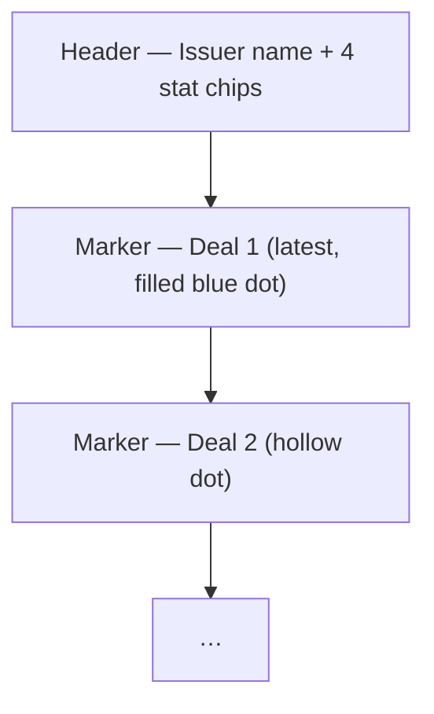

# IssuerTimeline

Source: [client/src/components/dcm/IssuerTimeline.tsx](../../../client/src/components/dcm/IssuerTimeline.tsx)

A vertical timeline of an issuer's bond deals, rendered in response to the `get_issuer_deals` tool. Wrapped in `React.memo`.

## Props

```ts
interface IssuerTimelineProps {
  issuerName: string;
  deals: Deal[];
  summary: {
    totalDeals: number;
    totalRaised: number;
    avgTenor: string;
    avgNip: number;
    avgOversubscription: number;
  };
}
```

## Visual structure

- **Card shell** (stone header, no gradient)
- **Header** with issuer name + a horizontal row of 4 stat chips
- **Timeline body** with a vertical 2px blue rule and circle markers



## Tailwind / styles

Header:

```tsx
<div className="px-4 py-3 bg-stone-100 border-b border-stone-200">
  <h3 className="font-semibold text-stone-800">{issuerName} - Issuance History</h3>
  <div className="flex gap-4 mt-2 text-xs">
    <span className="bg-white px-2 py-1 rounded border border-stone-200">
      <span className="text-stone-500">Deals:</span> <span className="font-semibold">{totalDeals}</span>
    </span>
    <!-- Total / Avg NIP / Avg Oversub same shape -->
  </div>
</div>
```

The Avg Oversub chip uses `text-emerald-600` for the value to flag positivity.

Timeline rule:

```tsx
<div className="absolute left-3 top-2 bottom-2 w-0.5 bg-blue-200" />
```

Each item:

```tsx
<div className="relative pl-8">
  <div className={`absolute left-1.5 top-1.5 w-3 h-3 rounded-full border-2 ${
    index === 0 ? 'bg-blue-500 border-blue-500' : 'bg-white border-blue-300'
  }`} />
  <div className="bg-stone-50 rounded-lg p-3 border border-stone-200 hover:border-blue-200 transition-colors">
    <!-- Two-column row: coupon/tenor + size/spread -->
    <div className="mt-2 flex gap-2">
      <span className={NIP_CHIP_CLASSES}>NIP: {nip}bps</span>
      <span className="text-xs px-1.5 py-0.5 rounded bg-stone-200 text-stone-600 font-mono">{isin}</span>
    </div>
  </div>
</div>
```

Spacing between items: `space-y-4`.

## NIP chip thresholds

Buckets in code (also used by `MarketIssuance` and the Dashboard's `IssuanceView`):

```tsx
deal.nip <= 5  ? 'bg-emerald-100 text-emerald-700' :
deal.nip <= 10 ? 'bg-amber-100 text-amber-700'    :
                 'bg-red-100 text-red-700'
```

See [components.md#4-state-chips-pills](../components.md#4-state-chips-pills).

## Color usage

- Top-of-timeline marker: filled blue (`bg-blue-500 border-blue-500`)
- Other markers: hollow blue (`bg-white border-blue-300`)
- Vertical rule: `bg-blue-200`
- Hover ring on items: `hover:border-blue-200`

## Icons

None — markers are CSS dots, NIP chips are plain text.

## Performance

`React.memo` — props are immutable per tool result and the timeline can include 10+ items, each with date/currency formatting.
