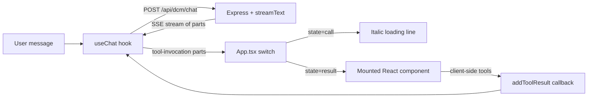

# Generative UI — How tool calls become React components

The model never emits HTML or JSX. It calls **tools**, the server streams those tool invocations to the client, and a single `switch` in [client/src/App.tsx](../../client/src/App.tsx) maps each tool name to a React component.

## End-to-end flow



The transport is Server-Sent Events. The Vercel AI SDK's `useChat` (`@ai-sdk/react`) handles framing and exposes typed `parts` per message.

## Anatomy of a message

```ts
type Message = {
  id: string;
  role: 'user' | 'assistant';
  parts: Part[];
  toolInvocations?: ToolInvocation[];
};

type Part =
  | { type: 'text'; text: string }
  | { type: 'tool-invocation'; toolInvocation: ToolInvocation };

type ToolInvocation = {
  toolCallId: string;
  toolName: string;
  args: unknown;
  state: 'partial-call' | 'call' | 'result';
  result?: unknown;
};
```

The chat column iterates over `message.parts` and dispatches on `part.type`. Tool parts dispatch on `toolInvocation.toolName` and `toolInvocation.state`.

## State machine per tool

| State | Meaning | Render |
|---|---|---|
| `partial-call` | The model is still streaming arguments | usually skipped |
| `call` | Args complete, waiting for result | italic loading line, e.g. `Querying employees...` |
| `result` | Tool finished, payload available | the matching React component |

For **client-side tools** (`collect_filters`, `confirm_action`) the server never sets a result — the component itself renders during the `call` state and the user's interaction calls `addToolResult({ toolCallId, result })` to advance the assistant.

## Tool → component mapping

The mapping is implemented as a flat switch starting around line 737 of [client/src/App.tsx](../../client/src/App.tsx).

### Generic data tools (defined in [server/src/tools.ts](../../server/src/tools.ts))

- `query_data` → `formatQueryResult()` helper which renders a header strip + [TableCard](components/table-card.md)
- `show_chart` → [ChartCard](components/chart-card.md)
- `show_table` → [TableCard](components/table-card.md)
- `collect_filters` → [FilterForm](components/filter-form.md) (client-side)
- `confirm_action` → [ApprovalCard](components/approval-card.md) (client-side)

### DCM tools (defined in [server/src/mcp/client.ts](../../server/src/mcp/client.ts))

- `resolve_entity` → [EntityPicker](components/entity-picker.md) when `confidence === 'ambiguous'`, otherwise an inline stone chip with the resolved short name, otherwise an amber "no matches" strip
- `get_market_deals` → [MarketIssuance](components/market-issuance.md)
- `get_issuer_deals` → [IssuerTimeline](components/issuer-timeline.md)
- `get_peer_comparison` → [ComparableDealsPanel](components/comparable-deals-panel.md)
- `get_allocations` → [AllocationBreakdown](components/allocation-breakdown.md)
- `get_performance` → [SecondaryPerformanceView](components/secondary-performance.md)
- `get_participation_history` → [TableCard](components/table-card.md) populated with mapped rows
- `generate_mandate_brief` → [ExportPanel](components/export-panel.md)

Anything not matched by name falls through to a generic fallback line:

```tsx
<div className="italic text-stone-500 py-2">
  Tool: {toolInvocation.toolName} ({toolInvocation.state})
</div>
```

## Error and empty-state rendering

Each DCM tool result is checked for `result.error` (or a missing required field) and falls back to a red strip:

```tsx
<div className="mt-2 px-3 py-2 bg-red-50 border border-red-200 rounded-lg text-sm text-red-700">
  {result.error}
</div>
```

`resolve_entity` with no matches uses the amber variant; `query_data` with empty rows shows an amber "No results found" strip inside `formatQueryResult`. See [components.md#6-inline-result-strips](components.md#6-inline-result-strips).

## Client-side tools — `addToolResult`

Both `collect_filters` and `confirm_action` are server-defined but have no `execute` function. The `useChat` hook keeps them in `state: 'call'` until the client provides a result.

`FilterForm.onSubmit`:

```tsx
addToolResult({ toolCallId: callId, result: { values } });
```

`ApprovalCard.onAction` / `onCancel`:

```tsx
addToolResult({ toolCallId: callId, result: { approvedActionId, cancelled: false } });
addToolResult({ toolCallId: callId, result: { cancelled: true } });
```

After the result is supplied, App.tsx renders a confirmation strip (emerald for filters, stone for action approved/cancelled) in the same place where the form/approval previously rendered.

## Auto-cancel on new user input

If the user sends a new message while one or more interactive tools are still in `state === 'call'`, App.tsx silently resolves them as `skipped: true` so the assistant can continue without a deadlock. The helper:

```tsx
const getPendingInteractiveTools = useCallback(() => {
  const pending = [];
  for (const message of messages) {
    if (message.role === 'assistant' && message.toolInvocations) {
      for (const tool of message.toolInvocations) {
        if (tool.state === 'call' &&
            (tool.toolName === 'collect_filters' || tool.toolName === 'confirm_action')) {
          pending.push({ toolCallId: tool.toolCallId, toolName: tool.toolName });
        }
      }
    }
  }
  return pending;
}, [messages]);
```

is called inside the form `submit` handler before `append`-ing the user's new message, with a `skipped: true` payload appropriate to each tool kind.

## Persistence

`useChat`'s `initialMessages` is hydrated from `localStorage` (key `pf-chat-sessions`, capped at `MAX_SESSIONS = 20` and `MAX_STORED_MESSAGES = 50` per session). The active session id is stored separately under `pf-active-session`. New chats are created lazily on first user message. Sessions are saved on every `messages` change and on `Switch session` / `Delete session` actions.

## Server endpoints

- `POST /api/dcm/chat` — primary endpoint, uses `dcmCombinedTools = { ...dcmTools, show_table, show_chart, confirm_action, collect_filters }` and the DCM system prompt
- `POST /api/chat` — legacy generic data assistant, `tools` only (bond_trades / employees / products data sources)
- `POST /api/auth/verify` — password gate (`APP_PASSWORD` env var)
- `GET /api/data/deals|allocations|secondary` — feeds the Dashboard views, no AI involved

The default frontend wiring uses `/api/dcm/chat` (see `API_URL` near the top of `App.tsx`).

## Adding a new generative component

1. **Define the tool** in [server/src/mcp/client.ts](../../server/src/mcp/client.ts) (or `server/src/tools.ts` for the generic data assistant). Provide a Zod schema for parameters and an async `execute` returning a JSON-serialisable object. For client-side tools (forms, approvals), omit `execute`.

2. **Register the tool** in the appropriate combined tools object exported by [server/src/index.ts](../../server/src/index.ts) (`dcmCombinedTools` for the DCM endpoint).

3. **Update the system prompt** to instruct the model when to call the new tool and what payload to expect (see `buildDCMSystemPrompt()` in `server/src/index.ts`).

4. **Build the React component** under [client/src/components/](../../client/src/components/) — follow the patterns in [components.md](components.md) (Card shell or Gradient-header card).

5. **Wire it up** in `App.tsx`'s `tool-invocation` switch:

   ```tsx
   if (toolInvocation.toolName === 'my_new_tool') {
     if (toolInvocation.state === 'call') {
       return <div key={callId} className="italic text-stone-500 py-2">Loading…</div>;
     }
     if (toolInvocation.state === 'result') {
       const result = toolInvocation.result;
       if (result.error) {
         return <div key={callId} className="mt-2 px-3 py-2 bg-red-50 border border-red-200 rounded-lg text-sm text-red-700">{result.error}</div>;
       }
       return <div key={callId} className="mb-4"><MyNewComponent {...result} /></div>;
     }
   }
   ```

6. **Document it** as a new file under [components/](components/) and add it to the mapping list above.
