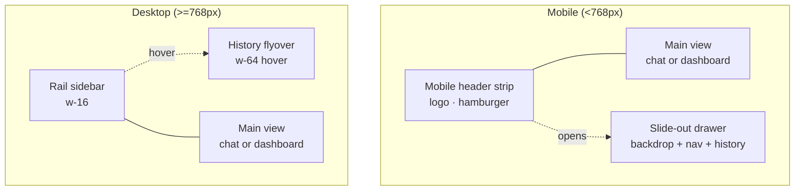

# Layout — App Shell

The shell is implemented end-to-end in [client/src/App.tsx](../../client/src/App.tsx) (with the Dashboard inner shell in [client/src/components/Dashboard.tsx](../../client/src/components/Dashboard.tsx)). It is responsive: a vertical mobile layout with a slide-out drawer, and a horizontal desktop layout with a slim icon rail and an optional hover-triggered History panel.



## Top-level structure

```tsx
<div className="flex flex-col md:flex-row h-screen w-full bg-[#FAFAF8]">
  {/* Mobile header */}
  {/* Mobile drawer (conditional) */}
  {/* Desktop rail */}
  {/* Desktop history flyover (conditional) */}
  {activeView === 'dashboard' ? <Dashboard /> : <ChatColumn />}
</div>
```

The active view is governed by `useState<'chat' | 'dashboard'>` in [client/src/App.tsx](../../client/src/App.tsx).

## Auth gate (Password screen)

Before anything else renders, an unauthenticated user gets a centered card:

- Background: `bg-[#FAFAF8]` covering `h-screen w-full`
- Content column: `max-w-sm px-6`
- Heading: `text-2xl font-semibold text-stone-800`
- Sub-text: `text-stone-500`
- Input: `px-4 py-3 text-sm bg-white border border-stone-200 rounded-xl outline-none focus:border-stone-400 focus:ring-1 focus:ring-stone-400`
- Continue button: brand-dark CTA `bg-stone-800 text-white rounded-xl hover:bg-stone-700`

Auth status persists in `localStorage` under the key `dcm-authenticated`.

## Mobile header (`<768px`)

```tsx
<div className="md:hidden flex items-center justify-between px-4 py-3 border-b border-[#E5E5E3] bg-[#F5F5F3]">
```

Contents:

- Logo tile: `w-8 h-8 rounded-lg bg-[#1A1A1A]` with `PF` glyph (`text-white font-bold text-xs`)
- Brand name: `Primary Flow`
- Hamburger button (`w-6 h-6` icon) opens the drawer

## Mobile drawer

Triggered by `isMobileMenuOpen`. Two layers:

1. **Backdrop**: `fixed inset-0 z-50` with `bg-black/50` (50% black) — clicking dismisses
2. **Drawer**: `absolute left-0 top-0 h-full w-64 bg-white shadow-xl flex flex-col`

Sections inside the drawer:

- Header (logo + close X)
- Menu items: New Chat, Chat (active), Recent (5 most recent), Data Viewer
- Bottom strip: Logout

Each menu item: `flex items-center gap-3 px-4 py-3 hover:bg-stone-50 transition-colors` with a `w-5 h-5 text-stone-600` icon. The active item gets a `bg-stone-100` background.

## Desktop rail (`>=768px`)

```tsx
<aside className="hidden md:flex w-16 flex-col items-center py-4 border-r border-[#E5E5E3] bg-[#F5F5F3] relative z-40">
```

Contents top-to-bottom:

1. Logo tile (`w-10 h-10 rounded-lg bg-[#1A1A1A]`) with `mb-8` separation
2. New chat button (`w-10 h-10 rounded-lg hover:bg-[#E5E5E3]`)
3. **Nav** (`flex-1`): History (clock) and Data Viewer (bar-chart)
4. **Bottom**: Logout

Active nav state colors the icon `text-[#1A1A1A]` and gives the button a `bg-[#E5E5E3]` background. Inactive icons are `text-stone-600`.

### History flyover (hover overlay)

Hovering the History icon sets `isHistoryHovered = true`, which mounts:

```tsx
<div className="hidden md:flex absolute left-16 top-0 w-64 h-full bg-white border-r border-[#E5E5E3] shadow-lg flex-col z-50">
```

It contains:

- Header strip with title `History` and a bookmark "pin" button
- Eyebrow label `Recent` (`text-xs uppercase tracking-wide text-stone-400`)
- A scrollable list of all sessions, each row revealing a per-row delete button on `group-hover/item:opacity-100`
- An empty state when no sessions exist

An invisible 4px bridge keeps the flyover open while the cursor crosses the gap from the rail to the panel.

## Main chat column

```tsx
<div className="flex-1 flex flex-col overflow-hidden">
  <div className="flex-1 overflow-auto">
    <header /* sticky */>…</header>
    <div className="max-w-3xl mx-auto px-4 md:px-6 py-8 flex flex-col gap-5">
      {/* messages */}
    </div>
  </div>
  <footer>{/* input */}</footer>
</div>
```

### Header

```tsx
<header className="px-4 md:px-6 pt-4 pb-4 border-b border-[#E5E5E3] bg-[#FAFAF8]/80 backdrop-blur-sm sticky top-0 z-10">
  <h1 className="text-lg font-semibold text-[#1A1A1A]">
    Primary Flow <span className="font-normal italic">Canvas</span>
  </h1>
</header>
```

The translucent `bg-[#FAFAF8]/80` plus `backdrop-blur-sm` lets the messages tint through when scrolled.

### Empty state

When `messages.length === 0`:

- Centered column (`min-h-[60vh]`)
- H2 with italic accent: `Component-first <em>flow</em>`
- Sub-text: `text-stone-500 mb-12 text-sm max-w-md text-center`
- Eyebrow: `text-xs font-medium text-stone-400 uppercase tracking-wide` reading "Try asking"
- Stack of 4 suggestion buttons, each `flex items-center gap-3 px-4 py-3 text-sm text-stone-600 bg-white border border-[#E5E5E3] rounded-xl hover:border-stone-300 hover:bg-stone-50 transition-colors text-left group`

### Message rows

User messages: right-aligned bubble (`self-end bg-stone-100 text-stone-800 px-4 py-2.5 rounded-2xl max-w-[80%]`).

Assistant messages: full-width left-aligned (`self-start text-stone-700 w-full rounded-2xl`). Each part renders either markdown or a tool component (see [generative-ui.md](generative-ui.md)).

### Loading indicator

When the `useChat` `isLoading` is true the column appends:

```tsx
<div className="self-start flex items-center gap-2 text-stone-400 text-sm">
  <svg className="animate-spin h-4 w-4" /* … */>…</svg>
  <span>Thinking...</span>
</div>
```

### Footer (chat input)

```tsx
<form className="relative flex items-center bg-white border border-[#E5E5E3] rounded-2xl shadow-sm focus-within:shadow-md focus-within:border-[#D5D5D3] transition-all">
  <button>{/* search */}</button>
  <input type="text" className="flex-1 px-3 py-4 text-sm bg-transparent outline-none placeholder-stone-400" />
  <button>{/* attach */}</button>
  {isLoading
    ? <button className="bg-red-500 text-white …">{/* stop */}</button>
    : <button className="bg-[#1A1A1A] text-white …">{/* send */}</button>}
</form>
```

The send button disables (`disabled:bg-stone-200 disabled:text-stone-400`) when the input is empty.

## Dashboard shell

`<Dashboard />` ([client/src/components/Dashboard.tsx](../../client/src/components/Dashboard.tsx)) reuses the same scroll container pattern but adds a centered tab bar:

```tsx
<header className="px-4 md:px-6 pt-4 pb-4 border-b border-[#E5E5E3] bg-[#FAFAF8]/80 backdrop-blur-sm sticky top-0 z-10">
  <div className="flex flex-col gap-3 md:flex-row md:items-center md:relative md:h-10">
    <h1>Primary Flow <span className="italic">Data</span></h1>
    <div className="flex gap-1 md:absolute md:left-1/2 md:-translate-x-1/2">
      {tabs.map(/* Issuance · Allocations · Secondary */)}
    </div>
  </div>
</header>

<div className="max-w-5xl mx-auto px-4 md:px-6 py-6">{tabContent}</div>
```

Tab styling:

- Active: `bg-[#1A1A1A] text-white`
- Inactive: `text-stone-600 hover:bg-[#E5E5E3]`
- All: `px-3 md:px-4 py-2 text-sm font-medium rounded-lg transition-colors`

## Responsive breakpoints

The app only uses one breakpoint, Tailwind's `md` (`>=768px`):

- `hidden md:flex` — show on tablet+
- `md:hidden` — show on mobile only
- `md:px-6`, `md:px-4` — wider gutters at desktop
- `md:flex-row`, `md:absolute`, `md:left-1/2 md:-translate-x-1/2` — desktop-only positioning of tabs/columns

There is no `lg:` or `xl:` usage anywhere in the app.

## Vertical rhythm

- App shell is `h-screen` and never scrolls itself
- The middle column has `flex-1 overflow-auto` so all scroll happens inside it
- Messages stack with `gap-5` (20px)
- Cards have a `mt-3` (12px) tail-in margin built into their root, so back-to-back tool results breathe automatically
